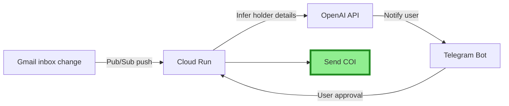

## Lion Insurance Services Automation

This project is about automation efforts for an Insurance Agency.

Currently it supports:
- Email monitoring for COI requests
- Automatically preparing and sending renewal documents to the clients
- Automatically setting up autopays at the beginning of each month

### COI Monitoring: How it works

